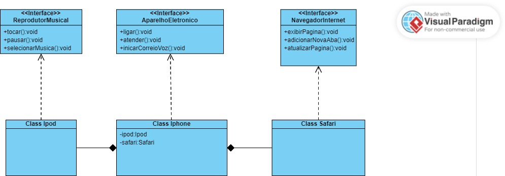

# Diagrama de Classes Iphone

Este repositório foi criado com o objetivo de realizar o desafio proposto pela DIO no Bootcamp do Santander, que consiste em realizar a modelagem e diagramação da representação UML e código referente ao componente iPhone.

## Digrama UML

